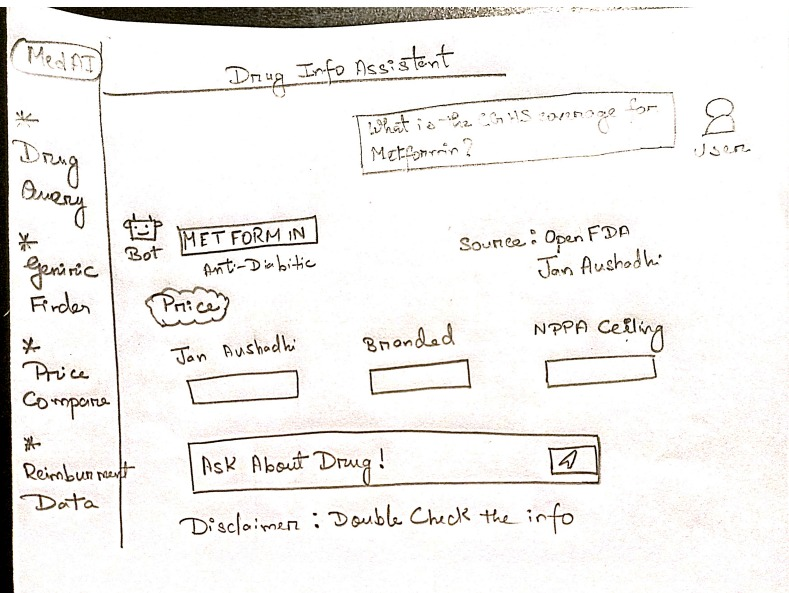
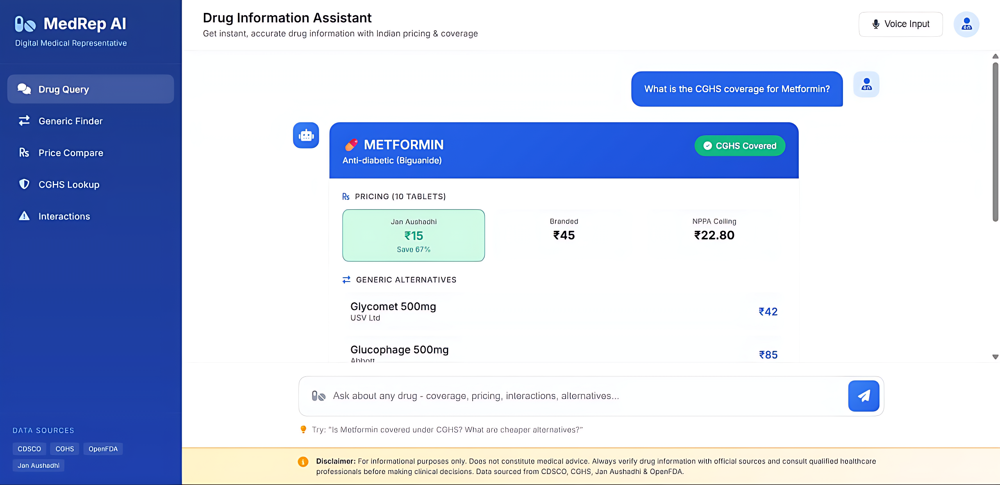

# 💊 MedRep AI - Digital Medical Representative

> An AI-powered assistant delivering instant, accurate drug information to Indian healthcare professionals.


---

## 📸 Screenshots

### System Wireframe
<!-- Add your wireframe/architecture diagram here -->


### Chat Interface
<!-- Add your chat interface screenshot here -->


*The above interface is AI-generated for demonstration purposes, showcasing our modern medical chat design with drug query capabilities, price comparisons, and CGHS coverage information.*

---

## 🎯 Problem Statement

Healthcare professionals in India face significant challenges:
- ⏰ **Time Waste**: Doctors spend 15+ minutes searching multiple databases for drug information
- 💰 **Cost Confusion**: Patients overpay due to lack of awareness about generic alternatives
- 📋 **Coverage Uncertainty**: Complex CGHS/PMJAY reimbursement rules
- ⚠️ **Safety Risks**: Difficulty in quickly checking drug interactions

---

## 💡 Our Solution

**MedRep AI** is a Digital Medical Representative that provides:

| Feature | Description |
|---------|-------------|
| 🔍 **Instant Drug Lookup** | Search any drug for complete information |
| 💰 **Price Comparison** | Jan Aushadhi vs Branded prices with savings % |
| ✅ **CGHS Coverage Check** | Real-time reimbursement eligibility |
| 🔄 **Generic Alternatives** | Cost-effective substitutes with same efficacy |
| ⚠️ **Drug Interactions** | Contraindications and warnings from OpenFDA |
| 🇮🇳 **Patient Translation** | Instructions in Hindi for patient education |

### 🫀 Specialty Focus: Cardiovascular & Metabolic

We use a **Two-Tier Hybrid Data Strategy**:

| Tier | Category | Drug Count | Data Level |
|------|----------|------------|------------|
| **Tier 1** | Cardiovascular + Diabetes | ~150 drugs | Full (interactions, prices, alternatives) |
| **Tier 2** | Antibiotics, Pain, GI, etc. | ~300 drugs | Basic (price + coverage only) |

**Why this approach?** Depth beats breadth. These categories affect 100M+ Indians and require complex interaction checking.

---

## 🔄 Query Flow

```
👨‍⚕️ Doctor asks: "Is Metformin covered? What are interactions and alternatives?"
                              │
                              ▼
┌─────────────────────────────────────────────────────────────────┐
│  STEP 1: Query Processing                                       │
│  • Identify drug name: "Metformin"                              │
│  • Identify intent: coverage + interactions + alternatives      │
│  • Convert query to embedding vector                            │
└─────────────────────────────────────────────────────────────────┘
                              │
              ┌───────────────┴───────────────┐
              ▼                               ▼
┌──────────────────────────┐    ┌──────────────────────────┐
│  STEP 2A: ChromaDB       │    │  STEP 2B: OpenFDA API    │
│  (Indian Data - Local)   │    │  (Clinical Data - Live)  │
│  ────────────────────    │    │  ──────────────────────  │
│  • CGHS coverage status  │    │  • Drug interactions     │
│  • Jan Aushadhi price    │    │  • Contraindications     │
│  • Generic alternatives  │    │  • Side effects          │
└──────────────────────────┘    └──────────────────────────┘
              │                               │
              └───────────────┬───────────────┘
                              ▼
┌─────────────────────────────────────────────────────────────────┐
│  STEP 3: Context Aggregation                                    │
│  Combined context from both sources                             │
└─────────────────────────────────────────────────────────────────┘
                              │
                              ▼
┌─────────────────────────────────────────────────────────────────┐
│  STEP 4: LLM Generation (Google Gemini)                         │
│  System Prompt + Context + User Query → Structured Response     │
└─────────────────────────────────────────────────────────────────┘
                              │
                              ▼
┌─────────────────────────────────────────────────────────────────┐
│  STEP 5: Structured Response                                    │
│  💊 Drug Info | ✅ Coverage | 💰 Prices | ⚠️ Interactions       │
└─────────────────────────────────────────────────────────────────┘
```

---

## ⚠️ Disclaimer

**For informational purposes only.** Does not constitute medical advice. Always verify drug information with official sources and consult qualified healthcare professionals before making clinical decisions.

---

## 📄 License

This project is licensed under the MIT License.

---

<p align="center">
  Made with ❤️ for Indian Healthcare
</p>
